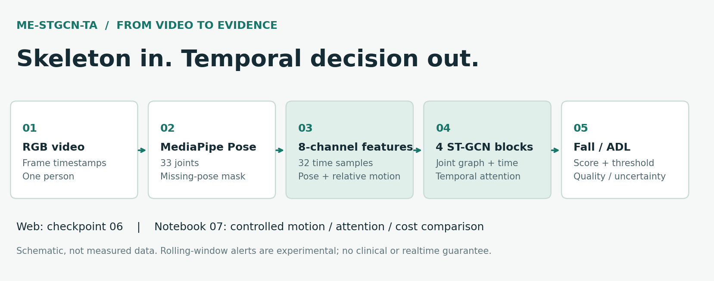
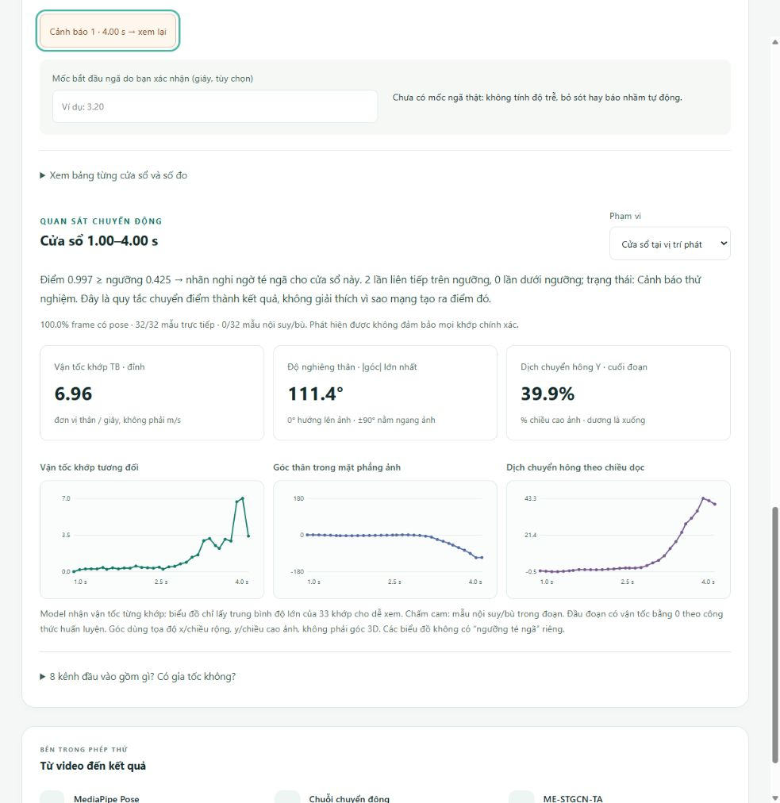
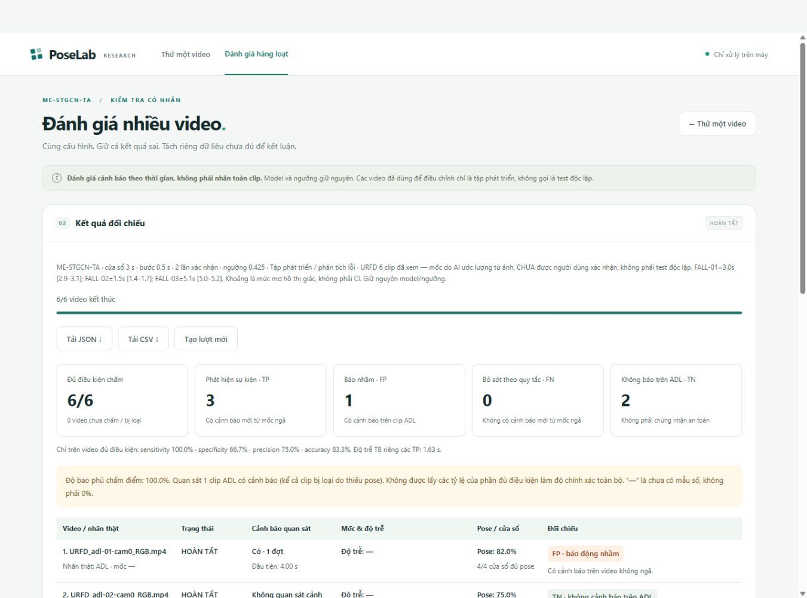
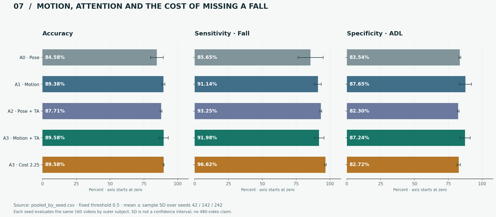
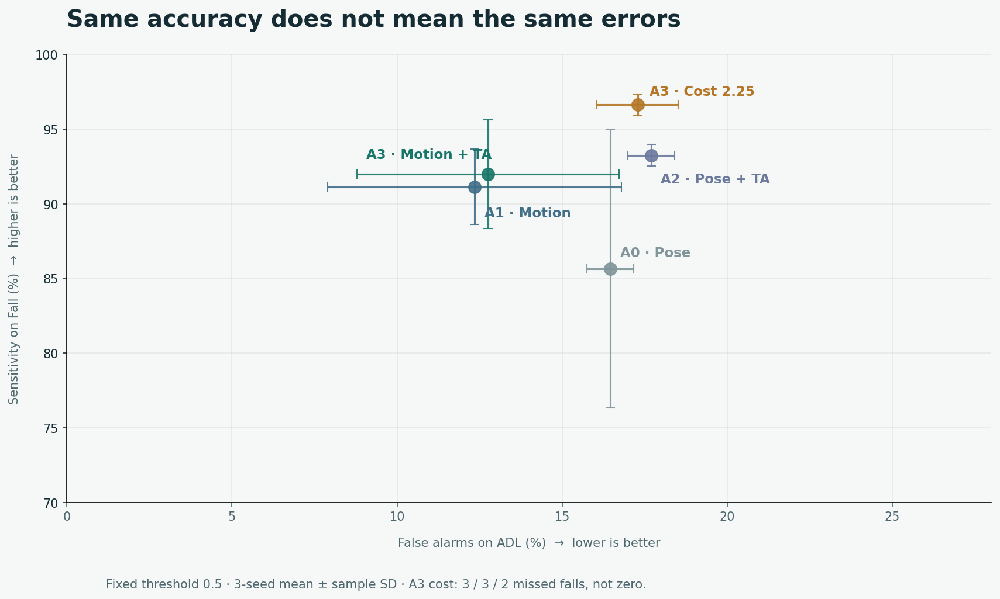

<div align="center">

# 🧠 ME-STGCN-TA · PoseLab

**Nhận diện té ngã từ khung xương · Thực nghiệm trên Kaggle · Web kiểm thử video local**


[Chạy web](#-chạy-web-trên-máy) · [Notebook](#-hành-trình-notebook) · [Kết quả](#-kết-quả-và-đánh-đổi) · [Hướng tiếp theo](docs/next-training.md)

</div>



> **Trạng thái ngày 30/09/2026:** web dùng **model 06**, notebook **07 đã chạy full** để kiểm chứng motion, temporal attention và trọng số lớp Fall. Hai pipeline không được trộn. Đây là đồ án/demo nghiên cứu, **không phải hệ thống cấp cứu hoặc thiết bị y tế**.

## 🎬 Demo: xem kết quả và chuyển động



*Ảnh chụp giao diện thật của một video đã xem: vận tốc tương đối, góc thân và dịch chuyển hông. Các đường biểu đồ mô tả đầu vào; không phải giải thích nhân quả hoặc xác suất đã hiệu chuẩn.*

<details>
<summary><strong>Đánh giá nhiều video có nhãn</strong></summary>



*Sáu clip URFD thuộc tập phát triển, mốc ngã do AI ước lượng và chưa được người gán nhãn độc lập xác nhận. Ảnh này chứng minh chức năng đối chiếu, không chứng nhận độ chính xác ngoài thực tế. Xem [giới hạn đánh giá ngoài](results/external_evaluation/README.md).*

</details>

### Chức năng giữ lại

- Upload video, xem pose trực tiếp và phân loại toàn clip.
- Cửa sổ trượt thử nghiệm, cảnh báo sau các cửa sổ xác nhận liên tiếp; phân biệt thiếu pose với ADL.
- Xem vận tốc khớp, góc thân, dịch chuyển hông, chất lượng pose và tải JSON/CSV.
- Đánh giá hàng loạt với nhãn Fall/ADL và mốc ngã do người dùng nhập.
- Trang [kết quả nghiên cứu](web_video_demo/static/research.html) dùng số liệu 07 đã hoàn tất.
- Xử lý tại máy, backend chỉ bind `127.0.0.1`; không tự gửi video lên dịch vụ cloud.

## 🚀 Chạy web trên máy

**Windows + Python 3.11:**

```powershell
git clone https://github.com/aBaoN9/me-stgcn-ta-fall-detection.git
cd me-stgcn-ta-fall-detection
.\web_video_demo\start.cmd
```

Mở **http://127.0.0.1:8765**. Lần đầu cần Internet để cài thư viện và tải MediaPipe Full có kiểm tra SHA-256. Model ONNX 06 và cấu hình đã nằm trong `models/deployment_06/`; **không cần dataset train để chạy web**.

Nếu cổng bị chiếm: `powershell -ExecutionPolicy Bypass -File .\web_video_demo\start.ps1 -Port 8766`. Giữ terminal mở, dừng bằng Ctrl+C. Không mở cổng ra Internet.

**Linux/macOS hoặc cài thủ công:**

```bash
python3.11 -m venv .venv
source .venv/bin/activate
python -m pip install -r web_video_demo/requirements.txt
python web_video_demo/prepare.py
cd web_video_demo
python -m uvicorn app:app --host 127.0.0.1 --port 8765
```

Windows là môi trường đã kiểm tra; hướng dẫn Linux/macOS chưa được chạy trên host tương ứng. Xem [hướng dẫn web](web_video_demo/README.md).

## 📓 Hành trình notebook

Không cần chạy tuần tự cả tám notebook. Output cell được bỏ để repo dễ đọc; số liệu thật được lưu riêng ở `results/`.

| Bản | Nội dung | Vai trò hiện tại |
|---|---|---|
| [01](notebooks/01-gmdcsa24-data-preparation.ipynb) | Video → pose → đặc trưng → folds | Tiền xử lý; cần video private |
| [02](notebooks/02-gmdcsa24-motion-svm.ipynb) | Motion-SVM | Baseline lịch sử |
| [03](notebooks/03-gmdcsa24-vanilla-stgcn.ipynb) | Vanilla ST-GCN | Baseline lịch sử |
| [04](notebooks/04-gmdcsa24-me-stgcn-ta.ipynb) | ME-STGCN-TA ban đầu | Lưu tiến trình; đã được thay bởi 06/07 |
| [04b](notebooks/04b-gmdcsa24-me-stgcn-ta-sensitivity.ipynb) | Ưu tiên sensitivity | Thử nghiệm giai đoạn trước |
| [05](notebooks/05-gmdcsa24-final-deployment.ipynb) | Train final và export ban đầu | Lịch sử; **không** phải checkpoint đang dùng |
| [06](notebooks/06-gmdcsa24-corrected-loso-final.ipynb) | Corrected angle, nested LOSO, export | **Model đang triển khai trên web** |
| [07](notebooks/07-gmdcsa24-controlled-ablation.ipynb) | Motion/attention/cost, 3 seed | **Kiểm chứng full đã hoàn tất**; chưa deployment |

Import notebook lên Kaggle, giữ **Private**, gắn input riêng rồi bật GPU cho 06/07. [Hướng dẫn chi tiết](docs/notebook-guide.md) ghi tên, input, chế độ chạy và cách lưu; [quy ước dữ liệu](data/README.md) ghi bốn file cần thiết. Code tương ứng 07 nằm trong `research07/`.

## 📊 Kết quả và đánh đổi

**07 · cùng recipe · ngưỡng fixed 0,5 · trung bình ba seed**. Mỗi seed đánh giá cùng 160 video qua bốn outer subject; không coi ba seed là 480 video độc lập.



| Cấu hình | Accuracy ± SD | Sensitivity | Specificity | FN ở seed 42 / 142 / 242 |
|---|---:|---:|---:|---|
| A0 · pose + average | 84,58 ± 4,73% | 85,65% | 83,54% | 3 / 17 / 14 |
| A1 · motion + average | 89,38 ± 1,08% | 91,14% | 87,65% | 9 / 5 / 7 |
| A2 · pose + attention | 87,71 ± 0,72% | 93,25% | 82,30% | 5 / 5 / 6 |
| A3 · motion + attention | 89,58 ± 3,44% | 91,98% | 87,24% | 3 / 8 / 8 |
| A3 · Fall weight ×2,25 | 89,58 ± 0,36% | **96,62%** | 82,72% | **3 / 3 / 2** |



**Không có accuracy trung bình 95%.** Motion hữu ích so với A0; thêm attention lên A1 chưa cho cải thiện rõ và nhất quán. Tăng trọng số Fall giảm bỏ sót nhưng tăng báo nhầm. `S4_FALL_05` vẫn bị bản cost bỏ sót trong cả ba seed.

- [Báo cáo 07](docs/report07.md): kết quả, lỗi lặp lại và cách hiểu.
- [Kết quả thô 07](results/notebook_07/README.md): predictions, errors, fold metrics, histories, attention, config/hash; không kèm 60 checkpoint thử.
- [Bản 06](results/model_06/README.md): OOF accuracy 87,50%, sensitivity 100%, specificity 75,31%, 20 FP/0 FN. Đây là **model theo fold**, không phải test độc lập của checkpoint final đã học toàn bộ dữ liệu.
- [Sáu video ngoài](results/external_evaluation/README.md): tập phát triển nhỏ, không gọi test độc lập.
- [Benchmark CPU](results/benchmark/README.md): MediaPipe là nút thắt quan sát được; ONNX-only không phải tốc độ cả hệ thống.

Các outer-test cũ đã được xem khi phát triển. So sánh 06 với 07 không phải ablation cùng recipe. Không chọn riêng seed 42 vì nó có kết quả đẹp nhất; không thay model web tự động bằng kết quả outer-test.

## 🗂️ Tài liệu và kiểm tra

```text
web_video_demo/          Web local, inference và giao diện
models/deployment_06/   ONNX + checkpoint final + cấu hình/hash
notebooks/              01, 02, 03, 04, 04b, 05, 06, 07
research07/             Feature v2, ST-GCN, train và validation
results/                Kết quả cuối, không có video/ZIP input
docs/                   Phương pháp, đề cương, báo cáo và ảnh
scripts/                Kiểm tra gói và tái tạo biểu đồ README
data/README.md          Hướng dẫn dữ liệu private, không chứa dataset
```

[Phương pháp và giới hạn](docs/methodology.md) · [Đề cương PDF](docs/de_cuong.pdf) · [Đề cương Word](docs/de_cuong.docx) · [Trạng thái tài liệu](docs/document-status.md) · [Kiểm tra bản đóng gói](docs/release-checks.md) · [Hướng train tiếp](docs/next-training.md)

```bash
python scripts/check_repository.py
```

Lệnh trên kiểm tra artifact, notebook, liên kết tài liệu và bảng kết quả, không train. Để kiểm tra pipeline có dữ liệu private, dùng môi trường riêng trong [research07/README.md](research07/README.md).

## 🔒 Quyền riêng tư và sử dụng

Repo này được tạo **Private**. Không đưa video gốc, pose/features private, file upload, môi trường ảo, token, hóa đơn hoặc output smoke lên Git. Đề cương có thông tin nhóm học tập; phải rà soát lại trước khi đổi repo sang Public. Không có giấy phép phát hành chung: việc truy cập repo không tự cấp quyền tái phân phối dữ liệu, model hoặc tài liệu bên thứ ba. Xem [NOTICE](NOTICE.md).
